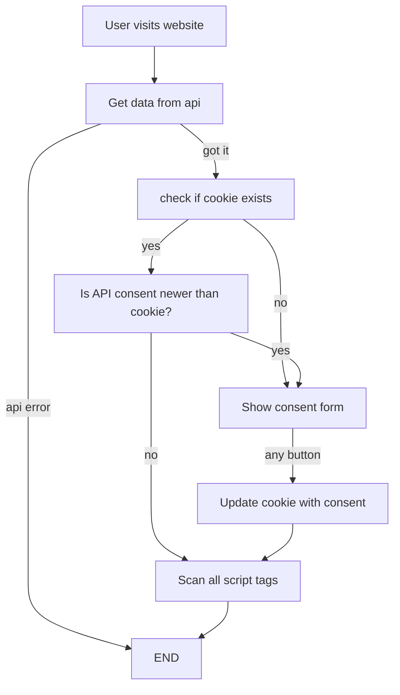

# 🍪 Cookie Consent Component


A GDPR-compliant cookie consent web component that **actually blocks scripts** until consent is granted.

## 🚀 [Live Demo](https://glideroggan.github.io/cookieConsent/)

Try the interactive demo to see how scripts are truly blocked and enabled based on user consent.

## ✨ Features

- **🚫 True Script Blocking** - Scripts with `type="text/plain"` are completely blocked by the browser
- **⚡ Zero Dependencies** - Pure vanilla TypeScript web component  
- **🎨 Fully Customizable** - Style and configure to match your brand
- **📱 Mobile Friendly** - Responsive design that works on all devices
- **🔧 Easy Integration** - Works with Google Analytics, Facebook Pixel, and any tracking script
- **🌐 API Integration** - Optional backend API for centralized consent management

# Usage
```html
<script type="module" src="https://unpkg.com/@glideroggan/cookie-consent/dist/cookie-consent.esm.js"></script>
```
- will create its own element `<cookie-consent></cookie-consent>`
- all script tags that should be blocked, should have their type set to `text/plain`, and the `data-consent` attribute set to the catorgory of the script, e.g. `data-consent="analytics"`.

# How it works
The component will check if a cookie exists with the name `cookie-consent`. If it does, it will check if the API consent is newer than the cookie. If it is, it will show the consent form. If the cookie does not exist, it will also show the consent form.

When the user accepts/declines, it will:
1. Update the cookie with the consent preferences
2. Automatically scan all script tags with `data-consent` attributes
3. Enable scripts by replacing `type="text/plain"` with executable script tags
4. Browser immediately downloads and runs the newly enabled scripts
5. Emit a `scripts-enabled` event with details about enabled categories

**No page reload required!** Scripts are dynamically enabled when consent is given.

# Flowchart


# BUGS
- removing a category and then switching over to global config, then the version is still lagging behind

# TODO
- we should do some sanity checks on the api
  - throttle number of post and put requests
  - restrict the inputs to not create overly long strings
  - restrict the maximum number of categories and cookies
- don't forgget that the admin part of the api should be used with an api key
  Do we really need this?
- need middleware for reporting cookies being created on server sides
- we need some way to show the entire list of the cookies
- more languages
- add the fallback categories in the slot of the element, so that users can specify fallback categories in the consent form
- Look into what we need to do to cover all the scripts in a page, because "document.querySelectorAll('script[data-consent]')" will not cover all cases
- mock up the actual consent form, in a stand alone html file